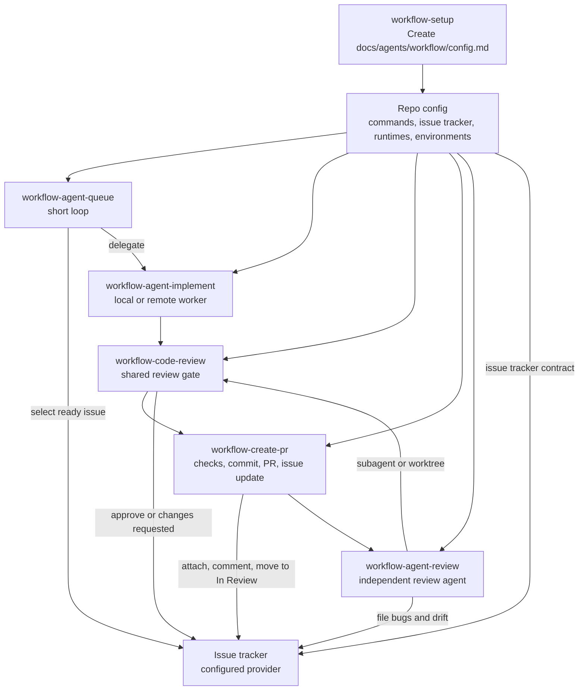
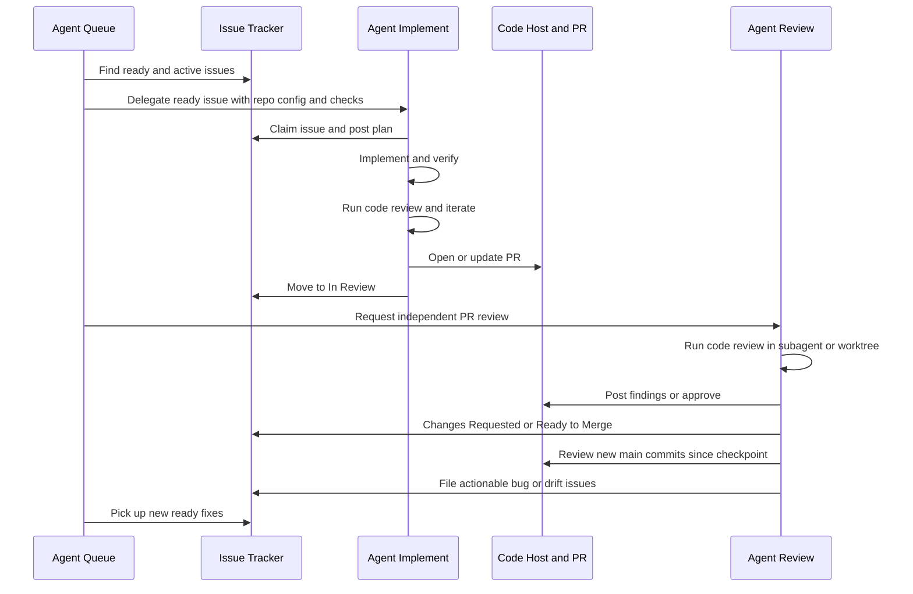

# Workflow Skills

Shared agent skills for running the same engineering workflow across
repositories.

The goal is to let any agent enter any repo, run the right skill, read the
repo-local config, and know how to work: which package manager to use, which
checks matter, where tracked work lives, how PRs are created, how remote workers
are launched, and what requires human approval.

## Core Idea

Every repo should have a tracked config file:

```text
docs/agents/workflow/config.md
```

Run `workflow-setup` to create or refresh it. The other skills read that file
first instead of guessing repo-specific details such as Bun vs pnpm, issue
tracker provider locations, labels, branch prefixes, preview checks, deploy
rules, and environment safety.



## Workflow

1. Set up repo config.
   Run `workflow-setup` once per repo and whenever commands, tracked workflow,
   runtime adapters, deploy rules, or environment safety rules change.

2. Track work in the issue tracker.
   The configured issue tracker is the system of record. PRs should link to
   issues whenever possible.
   Non-trivial untracked work should get a tracker issue before PR creation.

3. Implement one issue at a time.
   Use `workflow-agent-implement` for local work or remote worker tasks. It
   claims the issue, reads config, stays in scope, runs checks, runs code
   review, iterates on findings, and hands off to PR creation.

4. Run the shared code review gate.
   Use `workflow-code-review` for pre-PR checks, clean PR worktree review,
   and main-drift review. It is optimized for bugs, security, data loss, scope
   drift, missing tests, and contract mismatches. Agent Implement runs this
   before PR creation. Agent Review runs it from a clean context. CodeRabbit is
   optional escalation, not the default gate.

5. Create or update the PR.
   Use `workflow-create-pr` to gather context, find or create issue tracking,
   run configured checks, run code review, commit, push, open or update the PR,
   and update the issue tracker.

6. Review PRs against issues.
   Use `workflow-agent-review` for independent PR review. It launches
   `workflow-code-review` in a subagent or disposable worktree, checks
   issue fit, acceptance criteria, required checks, security invariants, and
   test quality, then reports whether the issue can move to the configured
   merge-ready state.

7. Keep the queue moving.
   `workflow-agent-queue` is the short-loop automation. It checks the
   issue tracker, unblocks active work, launches or nudges workers, requests PR
   reviews, updates statuses, and stops when human input is needed.

8. Watch main for drift.
   `workflow-agent-review` also runs the longer-loop quality automation. It
   reviews new main-branch commits since its checkpoint and files actionable
   tracker issues for regressions, security gaps, missing tests, or product
   contract drift.

## Automation Loops



The queue loop should run frequently while work is active. Agent Review should
run PR reviews as needed, and its main-drift pass should run less often, such as
hourly. Agent Review should never implement fixes itself.

## References

Setup uses bundled references to write repo-local config. These are not separate
skills:

- `skills/workflow-setup/references/project-config.md`: config template.
- `skills/workflow-setup/references/agent-workflow.md`: Agent Queue, Agent
  Review, Agent Implement, and adapter minimums.
- `skills/workflow-setup/references/issue-tracker-contract.md`: tracker states,
  labels, readiness rules, dependencies, and agent-ready issue body shape.

## Skills

The three long-running or delegated roles share the `workflow-agent-*` prefix:

- Agent Queue: `workflow-agent-queue`
- Agent Review: `workflow-agent-review`
- Agent Implement: `workflow-agent-implement`

- `workflow-setup`: create or refresh `docs/agents/workflow/config.md`.
- `workflow-create-pr`: take the current branch to a ready PR with issue tracker
  tracking.
- `workflow-code-review`: run the shared code review gate for local work,
  PRs, and main drift.
- `workflow-agent-implement`: Agent Implement, the worker role for one tracker
  issue locally or remotely through code review and PR creation.
- `workflow-agent-queue`: Agent Queue, the short-loop agent that keeps tracked
  work moving.
- `workflow-agent-review`: Agent Review, the independent reviewer for PRs and
  longer-loop main drift checks.

## Install

List available skills:

```sh
npx skills add zaks-io/skills --list
```

Install all skills globally for all supported agents:

```sh
npx skills add zaks-io/skills --all -g
```

Install one skill:

```sh
npx skills add zaks-io/skills --skill workflow-setup --agent '*' -g -y
```

For private cloud environments, grant the runtime access to this repository
through the provider's GitHub integration, or inject a read-only deploy key or
fine-grained token before running `skills add`.

## Done Means

A repo is ready to use these skills when:

- `docs/agents/workflow/config.md` exists and has no critical unknowns
- runtime adapters point agents to that config
- issue tracker provider, routing, statuses, labels, and body contract are recorded
- package manager and verification commands are recorded
- production deploy and credential rules are explicit
- `workflow-create-pr`, `workflow-code-review`, and
  `workflow-agent-implement` can run without guessing repo conventions

## Validate

```sh
pnpm ci:check
```

The check verifies formatting, skill frontmatter names,
`agents/openai.yaml` prompts, install metadata, dependency audit, and secret
scanning.
