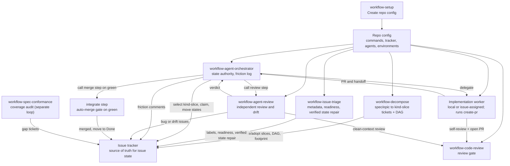

# Agent Workflow Details

This document holds the technical contract behind the workflow skills. README is
the usage guide. This file is for agents and maintainers who need the exact
state model and role split.

## Repo Config

Every downstream repo should have:

```text
docs/agents/workflow/config.md
```

Run `workflow-setup` once to create it, and rerun setup when the repo workflow
may have changed. Refresh runs read the existing config first, compare it against
current repo, tracker, CI, worker delegation, and environment state, then patch
stale or missing values. Other workflow skills read that file before guessing
repo-specific details such as package manager, issue tracker location, branch
prefix, review gate, preview checks, deploy rules, and environment safety.

Config should store query-safe tracker metadata, not just human-friendly repo
slugs: provider IDs, exact names or keys accepted by the tracker tool, status
field names, blocker relationship fields, routing labels, and a read-only query
that proved the mapping returns the intended issue set.

Setup must verify every populated value that can affect agent behavior. That
includes repo commands, code host state, CI checks, tracker metadata, worker
delegation, adapter paths, and environment safety rules. Values that cannot be
verified stay marked as inferred or unknown; they are not authoritative config.

## Systems Of Record

Workflow state must not live only in local agent files.

- Issue workflow state: configured issue tracker
- Claim records: issue tracker fields, assignments, labels, and comments
- Branch and PR state: configured code host
- Check and preview state: CI, preview, or hosted check provider
- Deploy state: deployment provider
- Orchestrator-local state: scratch, polling checkpoints, dispatch ledger, and
  duplicate suppression only

Agents must refresh the relevant systems of record before mutating anything. The
dispatch ledger is an ephemeral, non-authoritative cache of in-flight delegations
for stuck-worker detection and duplicate suppression; it may be empty on any tick
and is always reconciled against the tracker and code host.

The friction log is the one retrospective artifact and is intentionally not a
system of record. The orchestrator writes it as append-only comments on a
dedicated parked ticket and never reads it back to make decisions.

## Roles

- Decompose: the front door that turns a spec, PRD, or epic ticket into
  dependency-ordered one-PR `kind-slice` tickets. Adopts hand-created tickets
  instead of duplicating them, applies the agent-ready body contract and labels,
  and emits a dependency graph and predicted file footprint. Creates tickets; it
  does not implement, review, or move active work.
- Agent Orchestrator: reads external state, starts or nudges workers, calls
  review and integrate as steps, records a friction log, and owns the authority
  to mutate active workflow status in the issue tracker.
- Agent Implement: owns one delegated issue through implementation, checks,
  code review, PR creation, and handoff.
- Agent Review: reviews PRs and main drift from clean context, reports verdicts
  to Orchestrator, and files or recommends follow-up issues.
- Issue Triage: the bulk reconciler. Updates tracker metadata, readiness,
  dependencies, current status, and issue body shape so Todo tickets are clean,
  ready for agents, and the tracker reflects external reality. It does not review
  backlog by default; when something is unclear, it asks the user or leaves exact
  human next actions.
- Create PR: turns the current branch into a PR after checks and code review.
  This is the worker's shipping step, not a separate orchestration stage.
- Code Review: shared bug-focused review gate.

## Two Loops

The system runs two independent loops that share the tracker and never call each
other:

- Agent Orchestrator drives work forward. It runs continuously while a backlog
  exists, one stateless tick at a time, keeping its context thin.
- Spec-conformance audits coverage. It runs on its own cadence, reads the spec
  set against delivered work, and files gap tickets for under-delivery or drift.

Review and integrate are not loops. They are steps the orchestrator calls inside
a tick and waits on. Decompose and triage are not loops either; they are
front-loaded steps the user runs before orchestration.

## Ticket Kinds

Kind is a single-select axis, separate from type. Skills enforce exclusivity even
when the tracker label group does not.

- `kind-spec`: holds spec or PRD prose. Decompose input. Never dispatched.
- `kind-epic`: a parent or workstream container. Never dispatched.
- `kind-slice`: a one-PR implementation ticket. The only kind a worker runs.

Containers (`kind-spec`, `kind-epic`) are decompose input, not work to ship.
Decompose reads them and emits `kind-slice` children. The orchestrator hard-
refuses to dispatch a container even if it carries `ready-for-agent`.

## Self-Healing

Workflow skills recover from tracker mistakes without generating intent or hiding
problems. The shared rule: heal unambiguous mechanical mistakes, escalate intent,
never skip silently, record every fix.

- Heal when there is one correct answer from direct evidence: a wrong or
  duplicate `kind-*`, a stale label that resolves to a verified ID, a status
  contradicted by a merged PR.
- Escalate intent-level gaps with `needs-info` or `ready-for-human`. Never
  fabricate scope or acceptance criteria.
- Decompose and triage report heals in their run summaries. Orchestrator logs a
  `config-gap` friction entry per inline heal, so repeated mistakes become a list
  of what to fix upstream.

Self-healing cannot fix a bad spec; a vague PRD dead-ends at the user by design.

## Orchestration

Agent Orchestrator owns orchestration, not implementation. It chooses the next
action needed to get tickets handled safely: delegate a `kind-slice` to a worker,
nudge an existing worker, call the review step, call the integrate step, rerun
checks, route review feedback, heal or repair tracker metadata, log friction,
mark tickets for human review or missing information, move active workflow state,
or stop on a real blocker.

Downstream config should say which worker delegation paths the project supports:

- `local-worktree`: Agent Orchestrator starts local subagents, gives each worker
  an isolated worktree or branch, and coordinates issue state, PR state, checks,
  and review through the tracker.
- `issue-assigned`: Agent Orchestrator delegates the ticket to a
  tracker-exposed coding agent. In Linear, that means using the verified
  delegation field or agent account exposed by the integration. The tracker
  integration chooses the configured environment, the agent executes the ticket,
  and the agent submits the PR.

Issue-assigned agents can be Cursor, Codex, or any other agent the tracker can
assign. The skills do not infer this from local CLI availability.

Repo config should record only project-specific details that are annoying to
rediscover, such as supported worker delegation paths, routing labels, routing
fields, readiness label policy, worker environment label policy, startable work
criteria, or non-default continuation comment rules. The tracker remains the
source of truth for which agents are currently assignable.

Readiness and worker environment labels describe separate things. By default,
`ready-for-agent` means the ticket needs no further human refinement before
handoff to an implementation agent. A label such as `remote-worker` or
`remote-cursor` means the issue is approved to run in that configured worker
environment. These labels can be applied before dependencies are clear.
During requested intake cleanup, complete intake tickets can move to the ready
state before dependencies are clear. Dependencies, blocker relationships, and
blocked states gate whether Orchestrator may start or delegate the work.

Before assigning issue-assigned work, Orchestrator must verify the issue is
implementation-ready and unblocked using tracker status, labels, provider blocker
relationships, body blockers, existing claims, and open PR state. It must not
mutate a real issue to discover whether a delegation field or agent name works.
If the user explicitly chooses issue-assigned agents and an implementation-ready
issue is missing only the configured worker environment metadata, Orchestrator
can repair that metadata without treating dependencies as a label blocker. It
still must not start blocked work.

If Agent Orchestrator needs to send fixes, review feedback, failed-check
details, or PR process instructions back to that agent, it should reply on the
original issue thread or configured tracker thread. That keeps the same session
in context. Starting a new assignment is only for cases where the original
session cannot continue.

## Flow



```mermaid
sequenceDiagram
  participant D as Decompose
  participant I as Issue Triage
  participant Q as Agent Orchestrator
  participant T as Issue Tracker
  participant W as Implementation Worker
  participant G as Code Host and PR
  participant R as Agent Review

  D->>T: Create/adopt kind-slice tickets, DAG, footprint
  I->>T: Clean labels, kinds, readiness, dependencies, verified stale state
  Q->>T: Refresh startable (kind-slice) and active issues
  Q->>G: Refresh PR, branch, check, and preview state
  Q->>Q: Reconcile dispatch ledger; re-dispatch stuck workers
  Q->>T: Claim issue and move to In Progress
  Q->>W: Delegate issue through supported worker path
  W->>W: Implement, self-review with code review, iterate
  W->>G: Open PR via create-pr
  W->>Q: Handoff PR ready for review state
  Q->>T: Move to In Review
  Q->>R: Call review step in clean context
  R->>Q: Changes requested or ready verdict
  Q->>T: Changes Requested or Ready to Merge
  Q->>G: On green, rebase if needed, merge, post-merge check
  Q->>T: Move to Done
  Q->>T: Friction comment for any heal, stuck worker, or thrash
```

## Status Ownership

The issue tracker stores the current issue state. Issue Triage may move complete
issues from configured intake states to the configured ready state only when
intake cleanup is requested, and it may reconcile verified stale states such as
marking a ticket `Done` when the linked PR is already merged. Agent Orchestrator
is the default writer for active workflow status transitions. Other roles can
recommend state changes, but they should not move active work unless the repo
config or user explicitly delegates that authority.

Default rule:

- Decompose can create and adopt `kind-slice` tickets, set kind/type/risk/
  readiness labels, encode dependencies, and write the agent-ready body. It does
  not move active work.
- Issue Triage can edit labels, kinds, readiness, body shape, dependencies,
  metadata, and verified stale states. It does not review backlog unless asked.
- Agent Implement can post plan, branch, PR, check results, and handoff.
- Create PR can attach the PR and report the review-state handoff.
- Agent Review can post findings and verdicts.
- Agent Orchestrator moves active work through `In Progress`, `In Review`,
  `Changes Requested`, and `Ready to Merge`, and to `Done` after it merges
  through the integrate gate when config grants merge authority.

## Handoff

Use the shared handoff shape from
`skills/workflow-setup/references/handoff.md`.

Every handoff should say:

- issue, branch, PR, owner, agent path, and environment
- current state and next owner
- checks run
- whether code review covers the current diff
- tracker updates made or requested
- blockers and residual risk

## Environment Model

Downstream config should define these clearly:

- Local: self-contained unless the repo says otherwise.
- Development: may use cloud backing services while the app runs locally.
- Preview: PR-scoped unless the repo says otherwise.
- Production: explicit approval required.

Hosted checks are not automatically safe. Config must say which hosted checks are
allowed without approval and which need approval.

## Adapter Notes

These skills keep a portable `SKILL.md` core for Codex, Claude, and other Agent
Skills systems.

- Side-effecting workflows use manual invocation.
- `workflow-code-review` and `workflow-agent-review` use clean context where the
  agent tooling supports it.
- Tool-specific permissions belong outside the shared skill contract.
- Code host and issue tracker tools come from each repo's workflow config.
- Worker delegation paths are repo-specific. Issue-assigned agents, when
  available, are discovered from the tracker. Repo config records only supported
  paths and project-specific routing or continuation comment details.

## References

Setup uses these bundled references when writing repo config:

- `skills/workflow-setup/references/project-config.md`
- `skills/workflow-setup/references/agent-workflow.md`
- `skills/workflow-setup/references/issue-tracker-contract.md`
- `skills/workflow-setup/references/handoff.md`

## Skill Quality Bar

- One job per skill.
- One top-level heading per skill.
- Explicit `Inputs` and `Done` or `Output` sections.
- Keep provider-specific details in downstream repo config.
- Add scripts only when deterministic behavior or external tooling justifies
  them.
