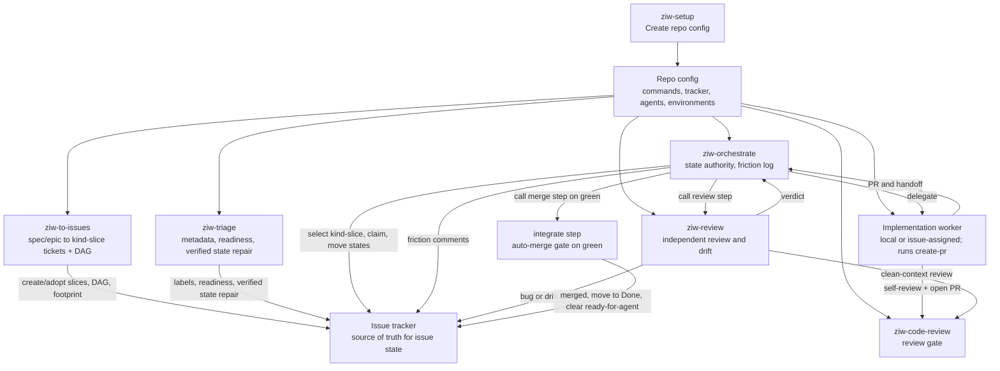

# Agent Workflow Details

This document holds the technical contract behind the workflow skills. README is
the usage guide. This file is for agents and maintainers who need the exact
state model and role split.

The research basis for this contract is
[agent-delivery-research.md](agent-delivery-research.md). Update that note when
research changes a workflow rule.

## Repo Config

Every downstream repo should have:

```text
docs/agents/workflow/config.md
```

Run `ziw-setup` once to create it, and rerun setup when the repo workflow
may have changed. Refresh runs read the existing config first, compare it against
current repo, tracker, CI, worker delegation, and environment state, then patch
stale or missing values. Other workflow skills read that file before guessing
repo-specific details such as package manager, issue tracker location, branch
prefix, review gate, preview checks, deploy rules, and environment safety.

Config should store query-safe tracker metadata, not just human-friendly repo
slugs: provider IDs, exact names or keys accepted by the tracker tool, status
field names, blocker relationship fields, routing labels, and a read-only query
that proved the mapping returns the intended issue set.

Setup must verify every populated value that can affect agent behavior. That
includes repo commands, code host state, CI checks, tracker metadata, worker
delegation, adapter paths, and environment safety rules. Values that cannot be
verified stay marked as inferred or unknown; they are not authoritative config.

## Systems Of Record

Workflow state must not live only in local agent files.

- Issue workflow state: configured issue tracker
- Claim records: issue tracker fields, assignments, labels, and comments
- Review evidence labels: issue tracker labels plus adjacent tracker comments
  or fields that record PR URL and reviewed head SHA
- Branch and PR state: configured code host
- Check and preview state: CI, preview, or hosted check provider
- Deploy state: deployment provider
- Orchestrator-local state: scratch, polling checkpoints, dispatch ledger, and
  duplicate suppression only

Agents must refresh the relevant systems of record before mutating anything. The
dispatch ledger is an ephemeral, non-authoritative cache of in-flight delegations
for stuck-worker detection and duplicate suppression; it may be empty on any tick
and is always reconciled against the tracker and code host.

The friction log is the one retrospective artifact and is intentionally not a
system of record. The orchestrator writes it as append-only comments on a
dedicated parked ticket and never reads it back to make decisions.

Friction logging should favor compact run rollups over per-tick chatter. Per
event entries are useful for escalations, re-dispatches, file contention, review
thrash, merge conflicts, and post-merge failures. A bounded run should also emit
counts for started, merged, waiting, blocked, first-pass checks, review rework,
stuck workers, and agent cost when available.

Friction entries use one canonical category per event. Resolved state, false
alarms, or infra-flake notes belong in `what` or `signal`, not in the category.
Do not combine multiple events in one friction comment; use rollups for
aggregation.

## Roles

- To Issues: the front door that turns a spec, PRD, or epic ticket into
  dependency-ordered one-PR `kind-slice` tickets. Adopts hand-created tickets
  instead of duplicating them, applies the agent-ready body contract and labels,
  puts ready slices in the configured ready state, and emits a dependency graph
  and predicted file footprint. Creates tickets; it does not implement, review,
  or move active work.
- Agent Orchestrator: reads external state, starts or nudges workers, calls
  review and integrate as steps, records a friction log, and owns the authority
  to mutate active workflow status in the issue tracker.
- Agent Implement: owns one delegated issue through implementation, checks,
  code review, PR creation, and handoff.
- Agent Review: reviews latest committed PR heads and main drift from clean
  context, reports freshness, verdicts, and orchestrator refactor findings to
  Orchestrator, and files or recommends follow-up issues.
- Issue Triage: the bulk reconciler. Updates tracker metadata, readiness,
  dependencies, current status, and issue body shape so Todo tickets are clean,
  ready for agents, and the tracker reflects external reality. It does not review
  backlog by default; when something is unclear, it asks the user or leaves exact
  human next actions.
- Create PR: turns the current branch into a PR after checks and code review.
  This is the worker's shipping step, not a separate orchestration stage.
- Code Review: shared bug-focused review gate.

Setup, To Issues, Issue Triage, Agent Orchestrator, Agent Implement, and Agent
Review are the core workflow roles. Code Review, Create PR, and Secret
Redaction are helper gates used by those roles.

PR draft state is code-host state, not tracker state. Draft and
ready-for-review are mutually exclusive. A draft PR is pre-review; a
ready-for-review PR is non-draft.

`Code review passed` is a review-evidence label, not a workflow status. It means
the latest linked PR head SHA has passed the configured code review gate for the
ticket. It must be applied with PR URL and reviewed head SHA evidence, and
removed when the PR head changes, blocking findings appear, the linked PR
changes, or evidence is missing.

## Loop Model

The system has one active work loop: Agent Orchestrator. It drives work forward
one stateless tick at a time while keeping its context thin.

The loop is self-scheduling. It runs on the runtime's own recurring mechanism (a
schedule, `/loop`, or wake-up timer in Claude Code; Codex automations, either
cron automations or heartbeat automations) and never needs a human to re-trigger
a pass. Each tick wakes light, rebuilds the queue from systems of record, acts on
a bounded slice of work, persists only the ledger and checkpoint, and sleeps only
when future external signal can still arrive. A long-running loop stays as light
as a first run; it does not loop in-context until the backlog empties. The
orchestrator skill bundles the tick contract in
`skills/ziw-orchestrate/references/loop-contract.md`.

If the refreshed scope is completely blocked, Orchestrator stops the recurring
loop for that scope instead of waking forever. Completely blocked means there are
no startable tickets, returned PRs to advance, stuck workers to nudge, failed
checks to rerun or route, stale metadata repairs, or in-flight work that can still
produce signal. The blocked report names each blocker, next owner, and the
condition that would make the scope runnable again.

Review and integrate are steps the orchestrator calls inside a tick and waits
on. To Issues and triage are front-loaded steps the user runs before
orchestration, or bounded repair steps the orchestrator can delegate when current
work is stale.

Integrate prepares the local default-branch checkout before interpreting
post-merge failures: refresh dependencies when the workspace graph changed,
rebuild or regenerate configured artifacts, and run the configured post-merge
check with the configured runner.

## Ticket Kinds

Kind is a single-select axis, separate from type. Skills enforce exclusivity even
when the tracker label group does not.

- `kind-spec`: holds spec or PRD prose. To Issues input. Never dispatched.
- `kind-epic`: a parent or workstream container. Never dispatched.
- `kind-slice`: a one-PR implementation ticket. The only kind a worker runs.

Containers (`kind-spec`, `kind-epic`) are To Issues input, not work to ship.
To Issues reads them and emits `kind-slice` children. The orchestrator hard-
refuses to dispatch a container even if it carries `ready-for-agent`.

## Agent Suitability

Delegation is based on work type, risk, and verification quality. Good default
agent work includes docs, tests, build or CI updates, small local refactors,
scoped bugs with reproduction, and isolated UI changes with target states.

Keep human planning in front of auth, authorization, PII, secrets, payments,
production, destructive data, broad refactors, cross-repo changes, unclear
domain behavior, and performance work without benchmarks. These can still become
agent work after the ticket has clear scope, safety constraints, and verification
commands.

## Self-Healing

Workflow skills recover from stale or inconsistent state without hiding
problems. The shared rule: use model judgment over current evidence, take the
next safe action when the evidence is enough, escalate missing intent or
authority, never skip silently, record every fix.

- Heal or repair when the model can identify a safe correction from evidence: a
  wrong or duplicate `kind-*`, a stale label that resolves to a verified ID, a
  status contradicted by a merged PR, a stalled draft PR with no remaining draft
  blocker, or a worker session that needs a direct nudge.
- Escalate intent-level gaps with `needs-info` or `ready-for-human`. Never
  fabricate scope or acceptance criteria.
- To Issues and triage report heals in their run summaries. Orchestrator logs a
  `config-gap` friction entry per inline heal, so repeated mistakes become a list
  of what to fix upstream.

Self-healing cannot fix a bad spec; a vague PRD dead-ends at the user by design.

## Orchestration

Agent Orchestrator owns orchestration, not implementation. Its job is to find
where tickets are stuck in the tracker-to-PR-to-merge pipeline, determine why
they are not advancing, and choose the next safe action needed to get them
handled. It uses model judgment to synthesize tracker state, PR state, checks,
review evidence, worker signals, repo config, and risk into actions. The named
actions are examples, not a complete menu; when a ticket is not moving,
Orchestrator should identify and take any safe workflow action needed to move it
forward. Examples include delegating a `kind-slice` to a worker, nudging an
existing worker, calling the review step, calling the integrate step, rerunning
checks, routing review feedback, requesting CodeRabbit escalation when the review
gate recommends it, diagnosing and repairing stuck draft PRs, marking unblocked
draft PRs ready-for-review, healing or repairing tracker metadata, applying or
removing review-evidence labels, logging friction, marking tickets for human
review when the next step genuinely needs human input, moving active workflow
state, or stopping on a real blocker.

When the user hands Orchestrator a large backlog that has already been triaged or
verified as ready to implement, Orchestrator owns the delivery lane. Routine
misunderstandings about when to apply a label, move a status, attach review
evidence, set repo-route metadata, or mark a PR ready-for-review are workflow
repairs. Orchestrator should fix them from tracker, PR, check, and config
evidence and keep going instead of escalating them.

Orchestrator can be invoked with explicit tickets, a tracker filter, a project,
a milestone, a label, one pass, or an `until clear` target. `Clear` means every
issue in scope has a truthful next state and owner: implemented, delegated,
ready for review, ready to merge, blocked, needs human input, or terminal. It
does not mean implementing vague future work without triage. If every scoped
issue is blocked and no orchestration action remains, the loop stops for that
scope.

Downstream config should say which worker delegation paths the project supports:

- `local-worktree`: Agent Orchestrator starts local subagents, gives each worker
  an isolated worktree or branch, and coordinates issue state, PR state, checks,
  and review through the tracker.
- `issue-assigned`: Agent Orchestrator delegates the ticket to a
  tracker-exposed coding agent. In Linear, that means using the verified
  delegation field or agent account exposed by the integration. The tracker
  integration chooses the configured environment, the agent executes the ticket,
  and the agent submits the PR.

Issue-assigned agents can be Cursor, Codex, or any other agent the tracker can
assign. The skills do not infer this from local CLI availability.

For local agent runtimes, the orchestrator should keep its parent thread small
and delegate large context loads to isolated workers when available. Claude Code
uses the plugin subagents `ziw-triager`, `ziw-implementer`, and
`ziw-reviewer`. Codex and other Agent Skills runtimes should use the
matching skill names, such as `$ziw-triage`,
`$ziw-implement`, `$ziw-review`, and
`$ziw-code-review`, inside isolated sessions, branches, worktrees, or
subagents when the runtime supports them.

Repo config should record only project-specific details that are annoying to
rediscover, such as supported worker delegation paths, routing labels, routing
fields, readiness label policy, worker environment label policy, startable work
criteria, direct-agent reply targets, or non-default continuation comment rules.
The tracker remains the source of truth for which agents are currently
assignable.

Readiness and worker environment labels describe separate things. By default,
`ready-for-agent` means the ticket needs no further human refinement before
handoff to an implementation agent. A label such as `remote-worker` or
`remote-cursor` means the issue is approved to run in that configured worker
environment. These labels can be applied before dependencies are clear. Remove
`ready-for-agent` when an issue moves to `Done`; done work is not waiting for
agent handoff.
During requested intake cleanup, complete intake tickets can move to the ready
state before dependencies are clear. Dependencies, blocker relationships, and
blocked states gate whether Orchestrator may start or delegate the work.

Before assigning issue-assigned work, Orchestrator must verify the issue is
implementation-ready and unblocked using tracker status, labels, provider blocker
relationships, body blockers, existing claims, and open PR state. It must also
verify the configured repo-route label (such as `<org>/<repo>`) is present, since
the assigned agent needs it to resolve which repository to clone; a missing
repo-route label is a hard block on delegation, healed inline when the team maps
unambiguously to one repo or escalated as `needs-info` otherwise. It must not
mutate a real issue to discover whether a delegation field or agent name works.
If the user explicitly chooses issue-assigned agents and an implementation-ready
issue is missing only the configured worker environment metadata, Orchestrator
can repair that metadata without treating dependencies as a label blocker. It
still must not start blocked work.

If Agent Orchestrator needs to send fixes, review feedback, failed-check
details, or PR process instructions back to that agent, it must reply into the
assigned agent's session thread, using the thread-root comment's `parentId`, not
a top-level issue comment. For remote Cursor agents, the integration posts an
"agent session" thread; a top-level issue comment does not continue the session.
Record the session handle (such as the `cursor.com/agents/bc-<id>` URL) in the
ledger. Starting a new assignment is only for cases where the original session
cannot continue.

When a PR is stuck in draft, Agent Orchestrator diagnoses the draft blocker from
repo policy, PR state, checks, comments, handoff notes, and the original worker
session. Draft state alone is not a reason to request code review. If no explicit
blocker remains, Agent Orchestrator marks the PR ready-for-review, then refreshes
the code-host PR state and verifies it is non-draft. If it stays draft, it is not
ready-for-review. CodeRabbit escalation follows the `ziw-code-review`
recommendation and is required only for high-risk or genuinely complex diffs, or
when the user asks for it.

## Flow



```mermaid
sequenceDiagram
  participant D as To Issues
  participant I as Issue Triage
  participant Q as Agent Orchestrator
  participant T as Issue Tracker
  participant W as Implementation Worker
  participant G as Code Host and PR
  participant R as Agent Review

  D->>T: Create/adopt kind-slice tickets, DAG, footprint
  I->>T: Clean labels, kinds, readiness, dependencies, verified stale state
  Q->>T: Refresh startable (kind-slice) and active issues
  Q->>G: Refresh PR, branch, check, and preview state
  Q->>Q: Reconcile dispatch ledger; re-dispatch stuck workers
  Q->>T: Claim issue and move to In Progress
  Q->>W: Delegate issue through supported worker path
  W->>W: Implement, self-review with code review, iterate
  W->>G: Open PR via create-pr
  W->>Q: Handoff PR state and review evidence
  Q->>T: Move to In Review
  Q->>R: Call review step in clean context
  R->>Q: Freshness, findings, CodeRabbit recommendation, PR readiness, refactor candidates, and reviewed head SHA
  Q->>G: Repair stuck draft PR or mark ready for review
  Q->>G: Request CodeRabbit if required by risk or complexity
  Q->>T: Apply or clear Code review passed
  Q->>T: Changes Requested or Ready to Merge
  Q->>G: On green, rebase if needed, merge, post-merge check
  Q->>T: Move to Done and remove ready-for-agent
  Q->>T: Friction entry or run rollup for heals, stuck workers, or thrash
```

## Status Ownership

The issue tracker stores the current issue state. Issue Triage may move complete
issues from configured intake states to the configured ready state only when
intake cleanup is requested, and it may reconcile verified stale states such as
marking a ticket `Done` when the linked PR is already merged. Agent Orchestrator
is the default writer for active workflow status transitions. Other roles can
recommend state changes, but they should not move active work unless the repo
config or user explicitly delegates that authority.

Default rule:

- To Issues can create and adopt `kind-slice` tickets, set kind/type/risk/
  readiness labels, encode dependencies, and write the agent-ready body. It does
  not move active work.
- Issue Triage can edit labels, kinds, readiness, body shape, dependencies,
  metadata, stale review-evidence labels, and verified stale states. It does not
  review backlog unless asked. When it verifies a ticket is `Done`, it removes
  `ready-for-agent`.
- Agent Implement can post plan, branch, PR, check results, and handoff.
- Create PR can attach or mark the PR ready-for-review when its local gates
  pass, verify the code-host PR is non-draft, and report the review-state
  handoff.
- Agent Review can post findings and verdicts.
- Agent Orchestrator moves active work through `In Progress`, `In Review`,
  `Changes Requested`, `Ready to Merge`, and `Done` after it merges through the
  integrate gate when config grants merge authority. It diagnoses stuck draft
  PRs without treating draft state as a review request, repairs blockers, verifies
  the code-host PR is non-draft, and applies or removes `Code review passed`
  based on current PR head SHA evidence. When it moves a ticket to `Done`, it
  removes `ready-for-agent`.

## Handoff

Use the shared handoff shape from
`skills/ziw-setup/references/handoff.md`.

Every handoff should say:

- issue, branch, PR, owner, agent path, and environment
- PR state: draft/pre-review or non-draft/ready-for-review
- current state and next owner
- checks run
- whether code review covers the current diff
- whether `Code review passed` is applied, removed, or requested for the current
  PR head SHA
- whether CodeRabbit is skipped, complete, or still required for the current diff
- tracker updates made or requested
- blockers and residual risk

## Environment Model

Downstream config should define these clearly:

- Local: self-contained unless the repo says otherwise.
- Development: may use cloud backing services while the app runs locally.
- Preview: PR-scoped unless the repo says otherwise.
- Production: explicit approval required.

Hosted checks are not automatically safe. Config must say which hosted checks are
allowed without approval and which need approval.

## Adapter Notes

These skills keep a portable `SKILL.md` core for Codex, Claude, and other Agent
Skills systems.

- Side-effecting workflows use manual invocation.
- `ziw-code-review` and `ziw-review` use clean context where the agent tooling
  supports it and review current committed code unless a working-tree review was
  explicitly requested.
- Tool-specific permissions belong outside the shared skill contract.
- Code host and issue tracker tools come from each repo's workflow config.
- Worker delegation paths are repo-specific. Issue-assigned agents, when
  available, are discovered from the tracker. Repo config records only supported
  paths and project-specific routing or continuation comment details.

## References

Setup uses these bundled references when writing repo config:

- `skills/ziw-setup/references/project-config.md`
- `skills/ziw-setup/references/agent-workflow.md`
- `skills/ziw-setup/references/issue-tracker-contract.md`
- `skills/ziw-setup/references/operating-profile.md`
- `skills/ziw-setup/references/linear-cursor-example.md`
- `skills/ziw-setup/references/handoff.md`

## Skill Quality Bar

- One job per skill.
- One top-level heading per skill.
- Explicit `Inputs` and `Done` or `Output` sections.
- Keep provider-specific details in downstream repo config.
- Add scripts only when deterministic behavior or external tooling justifies
  them.
