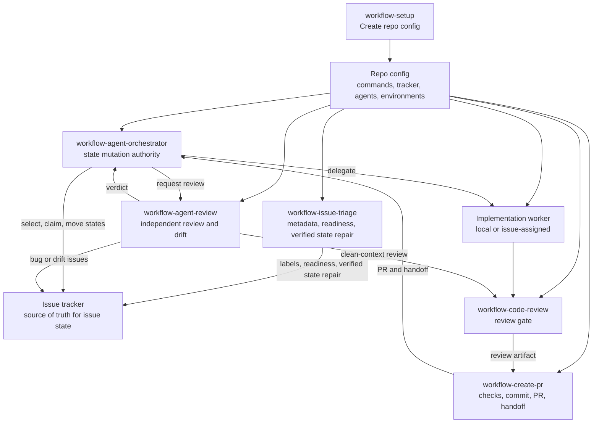
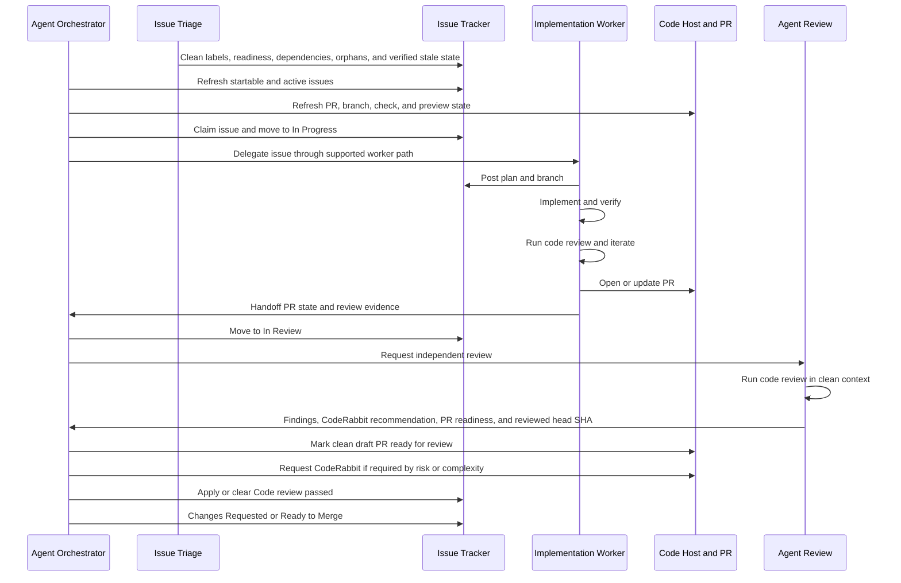

# Agent Workflow Details

This document holds the technical contract behind the workflow skills. README is
the usage guide. This file is for agents and maintainers who need the exact
state model and role split.

## Repo Config

Every downstream repo should have:

```text
docs/agents/workflow/config.md
```

Run `workflow-setup` once to create it, and rerun setup when the repo workflow
may have changed. Refresh runs read the existing config first, compare it against
current repo, tracker, CI, worker delegation, and environment state, then patch
stale or missing values. Other workflow skills read that file before guessing
repo-specific details such as package manager, issue tracker location, branch
prefix, review gate, preview checks, deploy rules, and environment safety.

Config should store query-safe tracker metadata, not just human-friendly repo
slugs: provider IDs, exact names or keys accepted by the tracker tool, status
field names, blocker relationship fields, routing labels, and a read-only query
that proved the mapping returns the intended issue set.

Setup must verify every populated value that can affect agent behavior. That
includes repo commands, code host state, CI checks, tracker metadata, worker
delegation, adapter paths, and environment safety rules. Values that cannot be
verified stay marked as inferred or unknown; they are not authoritative config.

## Systems Of Record

Workflow state must not live only in local agent files.

- Issue workflow state: configured issue tracker
- Claim records: issue tracker fields, assignments, labels, and comments
- Review evidence labels: issue tracker labels plus adjacent tracker comments
  or fields that record PR URL and reviewed head SHA
- Branch and PR state: configured code host
- Check and preview state: CI, preview, or hosted check provider
- Deploy state: deployment provider
- Orchestrator-local state: scratch, polling checkpoints, and duplicate
  suppression only

Agents must refresh the relevant systems of record before mutating anything.

## Roles

- Agent Orchestrator: reads external state, starts or nudges workers, asks for
  review, and owns the authority to mutate active workflow status in the issue
  tracker.
- Agent Implement: owns one delegated issue through implementation, checks,
  code review, PR creation, and handoff.
- Agent Review: reviews PRs and main drift from clean context, reports verdicts
  to Orchestrator, and files or recommends follow-up issues.
- Issue Triage: updates tracker metadata, readiness, dependencies, current
  status, and issue body shape so Todo tickets are clean, ready for agents, and
  the tracker reflects external reality. It does not review backlog by default;
  when something is unclear, it asks the user or leaves exact human next actions.
- Create PR: turns the current branch into a PR after checks and code review.
- Code Review: shared bug-focused review gate.

PR draft state is code-host state, not tracker state. Draft and
ready-for-review are mutually exclusive. A draft PR is pre-review; a
ready-for-review PR is non-draft.

`Code review passed` is a review-evidence label, not a workflow status. It means
the latest linked PR head SHA has passed the configured code review gate for the
ticket. It must be applied with PR URL and reviewed head SHA evidence, and
removed when the PR head changes, blocking findings appear, the linked PR
changes, or evidence is missing.

## Orchestration

Agent Orchestrator owns orchestration, not implementation. It chooses the next
action needed to get tickets handled safely: delegate implementation work, nudge
an existing worker, request another code review, rerun checks, route review
feedback, request CodeRabbit escalation when the review gate recommends it,
mark draft PRs ready-for-review after review gates pass, repair tracker
metadata, apply or remove review-evidence labels, mark tickets for human review
or missing information, move active workflow state, or stop on a real blocker.

Orchestrator can be invoked with explicit tickets, a tracker filter, a project,
a milestone, a label, one pass, or an `until clear` target. `Clear` means every
issue in scope has a truthful next state and owner: implemented, delegated,
ready for review, ready to merge, blocked, needs human input, or terminal. It
does not mean implementing vague future work without triage.

Downstream config should say which worker delegation paths the project supports:

- `local-worktree`: Agent Orchestrator starts local subagents, gives each worker
  an isolated worktree or branch, and coordinates issue state, PR state, checks,
  and review through the tracker.
- `issue-assigned`: Agent Orchestrator delegates the ticket to a
  tracker-exposed coding agent. In Linear, that means using the verified
  delegation field or agent account exposed by the integration. The tracker
  integration chooses the configured environment, the agent executes the ticket,
  and the agent submits the PR.

Issue-assigned agents can be Cursor, Codex, or any other agent the tracker can
assign. The skills do not infer this from local CLI availability.

For local agent runtimes, the orchestrator should keep its parent thread small
and delegate large context loads to isolated workers when available. Claude Code
uses the plugin subagents `workflow-triage`, `workflow-implementer`, and
`workflow-reviewer`. Codex and other Agent Skills runtimes should use the
matching skill names, such as `$workflow-issue-triage`,
`$workflow-agent-implement`, `$workflow-agent-review`, and
`$workflow-code-review`, inside isolated sessions, branches, worktrees, or
subagents when the runtime supports them.

Repo config should record only project-specific details that are annoying to
rediscover, such as supported worker delegation paths, routing labels, routing
fields, readiness label policy, worker environment label policy, startable work
criteria, or non-default continuation comment rules. The tracker remains the
source of truth for which agents are currently assignable.

Readiness and worker environment labels describe separate things. By default,
`ready-for-agent` means the ticket needs no further human refinement before
handoff to an implementation agent. A label such as `remote-worker` or
`remote-cursor` means the issue is approved to run in that configured worker
environment. These labels can be applied before dependencies are clear.
During requested intake cleanup, complete intake tickets can move to the ready
state before dependencies are clear. Dependencies, blocker relationships, and
blocked states gate whether Orchestrator may start or delegate the work.

Before assigning issue-assigned work, Orchestrator must verify the issue is
implementation-ready and unblocked using tracker status, labels, provider blocker
relationships, body blockers, existing claims, and open PR state. It must not
mutate a real issue to discover whether a delegation field or agent name works.
If the user explicitly chooses issue-assigned agents and an implementation-ready
issue is missing only the configured worker environment metadata, Orchestrator
can repair that metadata without treating dependencies as a label blocker. It
still must not start blocked work.

If Agent Orchestrator needs to send fixes, review feedback, failed-check
details, or PR process instructions back to that agent, it should reply on the
original issue thread or configured tracker thread. That keeps the same session
in context. Starting a new assignment is only for cases where the original
session cannot continue.

After clean review and passing required checks, Agent Orchestrator should mark a
draft PR ready-for-review unless the user or repo config explicitly says to keep
it draft. If it stays draft, it is not ready-for-review. CodeRabbit escalation
follows the `workflow-code-review` recommendation and is required only for
high-risk or genuinely complex diffs, or when the user asks for it.

## Flow





## Status Ownership

The issue tracker stores the current issue state. Issue Triage may move complete
issues from configured intake states to the configured ready state only when
intake cleanup is requested, and it may reconcile verified stale states such as
marking a ticket `Done` when the linked PR is already merged. Agent Orchestrator
is the default writer for active workflow status transitions. Other roles can
recommend state changes, but they should not move active work unless the repo
config or user explicitly delegates that authority.

Default rule:

- Issue Triage can edit labels, readiness, body shape, dependencies, metadata,
  stale review-evidence labels, and verified stale states. It does not review
  backlog unless asked.
- Agent Implement can post plan, branch, PR, check results, and handoff.
- Create PR can attach or mark the PR ready-for-review when its local gates
  pass, and report the review-state handoff.
- Agent Review can post findings and verdicts.
- Agent Orchestrator moves active work through `In Progress`, `In Review`,
  `Changes Requested`, and `Ready to Merge`, and repairs draft PRs that should
  already be ready-for-review. It also applies or removes `Code review passed`
  based on current PR head SHA evidence.

## Handoff

Use the shared handoff shape from
`skills/workflow-setup/references/handoff.md`.

Every handoff should say:

- issue, branch, PR, owner, agent path, and environment
- PR state: draft/pre-review or non-draft/ready-for-review
- current state and next owner
- checks run
- whether code review covers the current diff
- whether `Code review passed` is applied, removed, or requested for the current
  PR head SHA
- whether CodeRabbit is skipped, complete, or still required for the current diff
- tracker updates made or requested
- blockers and residual risk

## Environment Model

Downstream config should define these clearly:

- Local: self-contained unless the repo says otherwise.
- Development: may use cloud backing services while the app runs locally.
- Preview: PR-scoped unless the repo says otherwise.
- Production: explicit approval required.

Hosted checks are not automatically safe. Config must say which hosted checks are
allowed without approval and which need approval.

## Adapter Notes

These skills keep a portable `SKILL.md` core for Codex, Claude, and other Agent
Skills systems.

- Side-effecting workflows use manual invocation.
- `workflow-code-review` and `workflow-agent-review` use clean context where the
  agent tooling supports it.
- Tool-specific permissions belong outside the shared skill contract.
- Code host and issue tracker tools come from each repo's workflow config.
- Worker delegation paths are repo-specific. Issue-assigned agents, when
  available, are discovered from the tracker. Repo config records only supported
  paths and project-specific routing or continuation comment details.

## References

Setup uses these bundled references when writing repo config:

- `skills/workflow-setup/references/project-config.md`
- `skills/workflow-setup/references/agent-workflow.md`
- `skills/workflow-setup/references/issue-tracker-contract.md`
- `skills/workflow-setup/references/handoff.md`

## Skill Quality Bar

- One job per skill.
- One top-level heading per skill.
- Explicit `Inputs` and `Done` or `Output` sections.
- Keep provider-specific details in downstream repo config.
- Add scripts only when deterministic behavior or external tooling justifies
  them.
