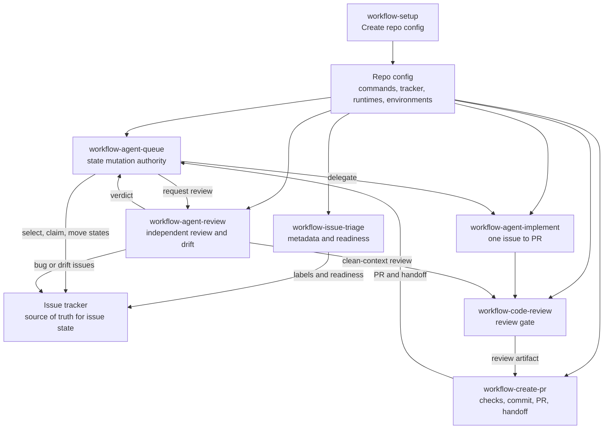
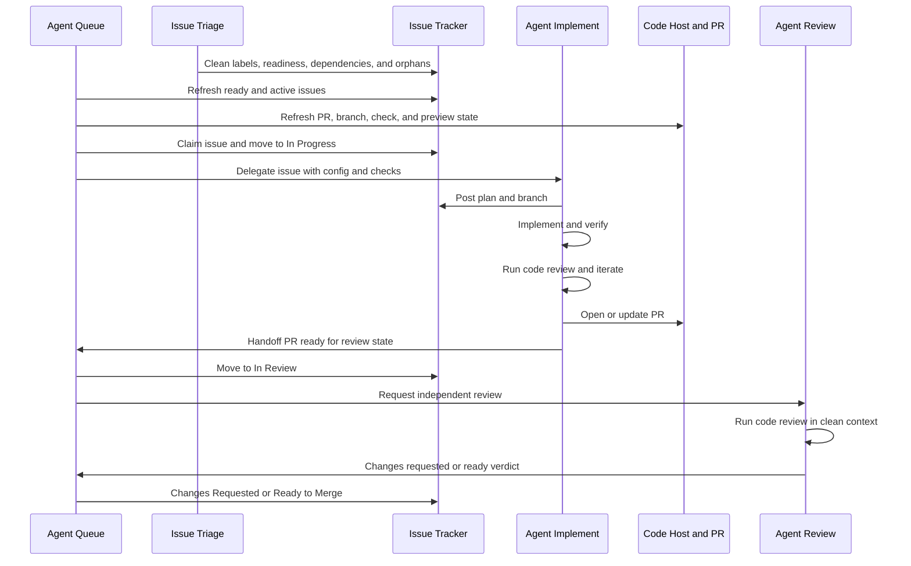

# Agent Workflow Details

This document holds the technical contract behind the workflow skills. README is
the usage guide. This file is for agents and maintainers who need the exact
state model and role split.

## Repo Config

Every downstream repo should have:

```text
docs/agents/workflow/config.md
```

Run `workflow-setup` to create or refresh it. Other workflow skills read that
file before guessing repo-specific details such as package manager, issue
tracker location, branch prefix, review gate, preview checks, deploy rules, and
environment safety.

## Systems Of Record

Workflow state must not live only in local agent files.

- Issue workflow state: configured issue tracker
- Claim records: issue tracker fields, assignments, labels, and comments
- Branch and PR state: configured code host
- Check and preview state: CI, preview, or hosted check provider
- Deploy state: deployment provider
- Queue-local state: scratch, polling checkpoints, and duplicate suppression
  only

Agents must refresh the relevant systems of record before mutating anything.

## Roles

- Agent Queue: reads external state, starts or nudges workers, asks for review,
  and owns the authority to mutate workflow status in the issue tracker.
- Agent Implement: owns one delegated issue through implementation, checks,
  code review, PR creation, and handoff.
- Agent Review: reviews PRs and main drift from clean context, reports verdicts
  to Queue, and files or recommends follow-up issues.
- Issue Triage: keeps tracker metadata, readiness, dependencies, and issue body
  shape clean so Queue can safely choose work.
- Create PR: turns the current branch into a PR after checks and code review.
- Code Review: shared bug-focused review gate.

## Flow





## Status Ownership

The issue tracker stores the current issue state. Queue is the default writer for
workflow status transitions. Other roles can recommend state changes, but they
should not move active work unless the repo config or user explicitly delegates
that authority.

Default rule:

- Issue Triage can edit labels, readiness, body shape, dependencies, and
  metadata.
- Agent Implement can post plan, branch, PR, check results, and handoff.
- Create PR can attach the PR and report the review-state handoff.
- Agent Review can post findings and verdicts.
- Agent Queue moves `Todo`, `In Progress`, `In Review`, `Changes Requested`,
  and `Ready to Merge`.

## Handoff

Use the shared handoff shape from
`skills/workflow-setup/references/handoff.md`.

Every handoff should say:

- issue, branch, PR, owner, runtime, and environment
- current state and next owner
- checks run
- whether code review covers the current diff
- tracker updates made or requested
- blockers and residual risk

## Environment Model

Downstream config should define these clearly:

- Local: self-contained unless the repo says otherwise.
- Development: may use cloud backing services while the app runs locally.
- Preview: PR-scoped unless the repo says otherwise.
- Production: explicit approval required.

Hosted checks are not automatically safe. Config must say which hosted checks are
allowed without approval and which need approval.

## Runtime Notes

These skills keep a portable `SKILL.md` core for Codex, Claude, and other Agent
Skills runtimes.

- Side-effecting workflows use manual invocation.
- `workflow-code-review` and `workflow-agent-review` use clean context where the
  runtime supports it.
- Runtime-specific tool permissions belong outside the shared skill contract.
- Code host and issue tracker tools come from each repo's workflow config.

## References

Setup uses these bundled references when writing repo config:

- `skills/workflow-setup/references/project-config.md`
- `skills/workflow-setup/references/agent-workflow.md`
- `skills/workflow-setup/references/issue-tracker-contract.md`
- `skills/workflow-setup/references/handoff.md`

## Skill Quality Bar

- One job per skill.
- One top-level heading per skill.
- Explicit `Inputs` and `Done` or `Output` sections.
- Keep provider-specific details in downstream repo config.
- Add scripts only when deterministic behavior or external tooling justifies
  them.
